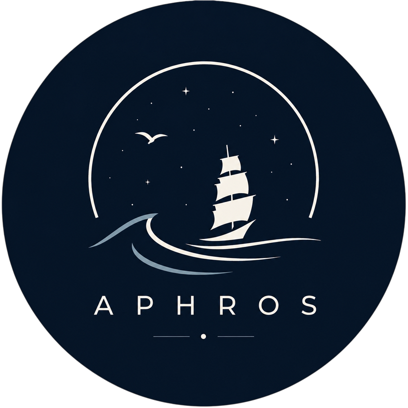

  

  

---

> *"Aphros is dedicated to the souls the sea has claimed. So sail aboard, my lads—raise a shanty for the fallen, and spare a thought for the ghosts in the foam. For they sank unnamed, so we could carry their story forward"*

---

  

   
  

<i>Your new tab. A ship deck under moonlight.</i>

---

## 🌊 What Is Aphros?

**Aphros** replaces your Chrome new tab with the sea.

I always had a fascination with the sea. So vast, so majestic, so unforgiving.

But I also never forgot the cost. Every horizon we chase was charted by hands we will never see, by sailors who sank unnamed. Aphros brings that gratitude to your browser. It’s more than a new tab—it’s a shanty player, a horizon, and a memorial for everyone who dedicated their life silently to the sea

So sail aboard, sing loud, and carry their story forward.

---

## ⚓ What You'll Find Aboard

| | |
|:--:|---|
| 🕐 | **A Clock of Frosted Glass** — large, translucent, floating over the horizon. The date sits beneath it like a captain's log entry. |
| 🔍 | **A Search Bar That Knows Its Place** — barely visible until you need it. The view always comes first. |
| 📌 | **Your Own Harbour** — pin the places you sail to most. Add, rename, rearrange. Small lanterns along the dock. |
| 🎵 | **The Crew Below Deck** — a built-in shanty player. *Randy Dandy Oh. Drunken Sailor. Santiana. Bonny Ship the Diamond.* Real working songs, with play, pause, skip and volume. |
| 🎨 | **Make It Yours** — fonts, colors, dark / light readability, soft UI sounds. Enough to feel like home without breaking the calm. |
| 🌅 | **The Sea Wall** — a rotating collection of ocean scenes. Moonlit water, fog banks, distant storms, dawn through grey clouds. Each new tab, a different voyage. |

---

<b>🎵 The Shanty Manifest</b>

 

These aren't playlists. These are the songs that kept men alive on ships that tried to kill them.

| # | Song | The Story |
|---|---|---|
| 1 | **Randy Dandy Oh** | Sung pulling anchor. The crew heaves together or nobody moves. |
| 2 | **Drunken Sailor** | The most famous shanty ever written. Everyone knows the words. Nobody knows who wrote them. |
| 3 | **Santiana** | About General Santa Anna. The sailors didn't care about the politics — they cared about the rhythm. |
| 4 | **Bonny Ship the Diamond** | A farewell from Peterhead as the whaling fleet leaves. Some of those ships didn't come back. |
| 5 | **Leave Her, Johnny** | Only sung at the end of a voyage. The one time the crew could complain about the captain, the food, and the sea herself. |
| 6 | **Wellerman** | Supply ships and long waiting. A song about hoping for something that might not come. |
| 7 | **Spanish Ladies** | The Royal Navy sailing home. Real landmarks hidden in the lyrics — singing their way back by memory. |
| 8 | **South Australia** | Ships carrying people to a new life. Half hope, half grief. The shore behind them getting smaller. |

 

More songs arrive with the tide.

---

## 🛠️ Installation steps

1. Unpack the release ZIP and remember the folder (e.g. `Aphros_|_New_Tab/`)
2. Open `chrome://extensions/` in Chrome
3. Enable **Developer mode** (top-right)
4. Click **Load unpacked**
5. Select the unpacked folder
6. Open a new tab — you're at sea

> Menu path works too: `⋮ > More tools > Extensions`. See [`HOW_TO_INSTALL.txt`](./HOW_TO_INSTALL.txt) for the same steps.

### Chrome Web Store

> Will add this extension there soon as well ! 

---

## 🧭 Why?

I listen to a lot of songs, but none of them give as much freedom as a shanty does. There is no set way to sing a shanty , never will. You do not need to be good. You do not need to be trained. You just sing. I think that is why I love them. Shanties are not performative, shanties are sung for yourself

I wanted to build something that captures that freedom. But I also wanted to build something that honors the immeasurable cost of it. People forget how much of humanity has advanced because of the people who lost their lives to the sea. And that word, forget, it haunts me. 

We talk about discovery and trade and progress like they are abstract things. They are not. They are bones. They are the trade routes, the migrations, the discoveries, they all rest on the bones of sailors we will never know. Because they did not just die. They were erased. The trade routes, the migrations, the discoveries, they all rest on the bones of sailors. Men who died screaming in the dark. Men who drowned alone. Men who were never found. And the world just kept moving.

Aphros is my way of paying that debt. It gives you a shanty to sing, a horizon to look at, and a silent reminder of the unseen hands that carried us here. It is not enough. It will never be enough. But it is all that I can do. It is me, saying thank you to people who will never hear it.

**And maybe, just maybe, when you open this tab and hear that shanty play, you will say thank you too.**

---

## 🪦 Dedication

*For the unnamed.*

*For the ones who sailed out and never sailed back.*

*For the crews swallowed by storms that history forgot.*

*For every soul the sea claimed and the shore stopped waiting for.*

 

*This tab is their lantern in the fog.*

---

Made with salt, silence, and too many late nights listening to shanties.

 

Free as the wind. Aphros v2.5 — <i>In memory of those, who chose the sea.</i> ⚓

  

